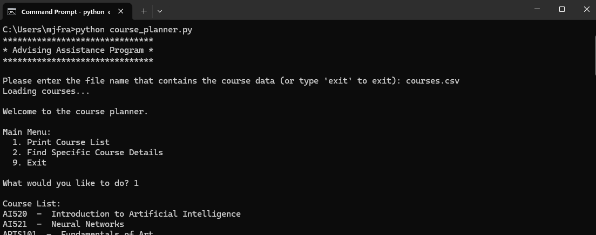

# Milton Francisco

# Computer Science Capstone

## Introduction and Professional Assessment

My journey into computer science began during my service as a Nuclear Machinist Mate in the United States Navy. In my last few years, I discovered coding challenges, and a passion for solving complex problems through technology followed. This newfound enthusiasm led me to pursue a Bachelor of Science degree in Computer Science at Southern New Hampshire University, where my academic and hands-on experiences deepened my technical knowledge.

Throughout my studies, I had the opportunity to engage in diverse team projects that refined my ability to collaborate effectively in dynamic environments. I led cross-functional groups including developers, designers, project managers, and clients, which sharpened my communication skills and ensured that project requirements were clearly articulated and met. Courses in Data Structures and Algorithms, along with Software Engineering, provided a solid foundation for tackling complex challenges by optimizing code for efficiency and designing robust and scalable systems. Hands-on experience in database implementation further refined my analytical skills and reinforced my commitment to data integrity and security best practices. A particularly formative experience was my internship at Blackbaud as a Software Engineer Intern, where I applied my academic knowledge to industry projects, collaborating with seasoned professionals on high-impact software development initiatives. This role deepened my understanding of agile methodologies, real-world software lifecycle management, and the importance of a robust security mindset, while enhancing my ability to communicate complex technical concepts to both technical teams and non-technical stakeholders.

This ePortfolio is a collection of artifacts that capture the breadth of my technical proficiency and problem-solving capabilities. The portfolio is organized around three core objectives:

- **Software Design & Engineering**

- **Algorithms & Data Structures**

- **Databases**

Each artifact demonstrates a unique aspect of my expertise. The enhancements I applied to these projects were specifically designed to meet these course outcomes:
1.	**Building Collaborative Environments:** Employ strategies for building collaborative environments that enable diverse audiences to support organizational decision making in the field of computer science.
2.	**Effective Communication:** Design, develop, and deliver professional-quality oral, written, and visual communications that are coherent, technically sound, and appropriately adapted to specific audiences and contexts.
3.	**Innovative Problem Solving:** Design and evaluate computing solutions that solve a given problem using algorithmic principles and computer science practices and standards appropriate to its solution, while managing the trade-offs involved in design choices.
4.	**Application of Advanced Techniques:** Demonstrate an ability to use well-founded and innovative techniques, skills, and tools in computing practices for the purpose of implementing computer solutions that deliver value and accomplish industry-specific goals.
5.	**Security Mindset:** Develop a security mindset that anticipates adversarial exploits in software architecture and designs to expose potential vulnerabilities, mitigate design flaws, and ensure privacy and enhanced security of data and resources.

Together, these artifacts form a cohesive narrative of my growth as a computer science professional. They integrate the principles and methodologies learned through coursework with the innovative practices required for real-world solutions. Beyond the technical work, the constructive feedback from instructors and the rich discussions with peers have continuously refined my professional outlook, fortifying my unwavering commitment to excellence.

Each artifact in this portfolio is accompanied by a narrative that details the enhancements made and explains how it meets the course outcomes. A code review of the initial artifacts can be viewed by clicking the button below:
 

## Artifact One: Database Dashboard using Python

**Brief Description:** This artifact was created to provide a user friendly way to interact with data in a large database. It was originally developed within a course provided virtual environment and utilized Jupyter Notebook with the Jupyter Dash library.

> [**Original Artifact Link**](https://github.com/milt-francisco/Capstone-Project/blob/main/Original-DataDashboard)

> [**Enhanced Artifact Link**](https://github.com/milt-francisco/Capstone-Project/tree/main/Enhancement%203-DataDashboard)

**Enhancement Details:** This artifact was only able to work within a specific virtual environment, that is unavailable to the public. Additionally, the data table contained all the information from the database which resulted in a cluttered view for unnecessary columns, like longitude and latitude. 

My first enhancement involved refactoring the program to work in a configurable environment. I utilized a MongoDB within an EC2 environment to make the database available remotely and modified the Python middleware to connect to the remote database.

My second enhancement involved refactoring the program to no longer use the deprecated Jupyter Dash library, reworking the data table to enable toggling of extraneous information, including additional information within the pie chart and resolving issues resulting from the refactor. 

The more detailed narratives for each enhancement can be found here: 
> [**Dashboard Narrative One**](https://github.com/milt-francisco/Capstone-Project/blob/main/DataDashboard_Narrative1.pdf)

> [**Dashboard Narrative Two**](https://github.com/milt-francisco/Capstone-Project/blob/main/DataDashboard_Narrative2.pdf)
 

## Artifact Two: Course Planner using an AVL Tree

**Brief Description:** This artifact was created to read and store college courses from a CSV file into a data structure for the purposes of course planning. Originally, the data was held in a vector and the data was required to be sorted. 

> [**Original Artifact Link**](https://github.com/milt-francisco/Capstone-Project/blob/main/Original-CoursePlanner)

> [**Enhanced Artifact Link**](https://github.com/milt-francisco/Capstone-Project/tree/main/Enhancement%203-DataDashboard)

**Enhancement Details:** My enhancement involved refactoring the code from C++ to Python and changing the data structure from a vector to a self-balancing binary search tree (AVL tree). In the original project, the data structure choices were a vector, hashmap, or binary search tree (BST), and the order of the data set was unknown. This led me to use a vector to prevent an unbalanced BST that results from an ordered data set. This enhancement ultimately reduced the time complexity for searches from O(n) to O(log n) and eliminated the need for sorting the data as it is already stored sorted. Additionally, changes were made in the file verification process to eliminate unnecessary steps.

The more detailed narrative for this enhancement can be found here: 
> [**Course Planner Narrative**](https://github.com/milt-francisco/Capstone-Project/blob/main/CoursePlanner_Narrative.pdf)

